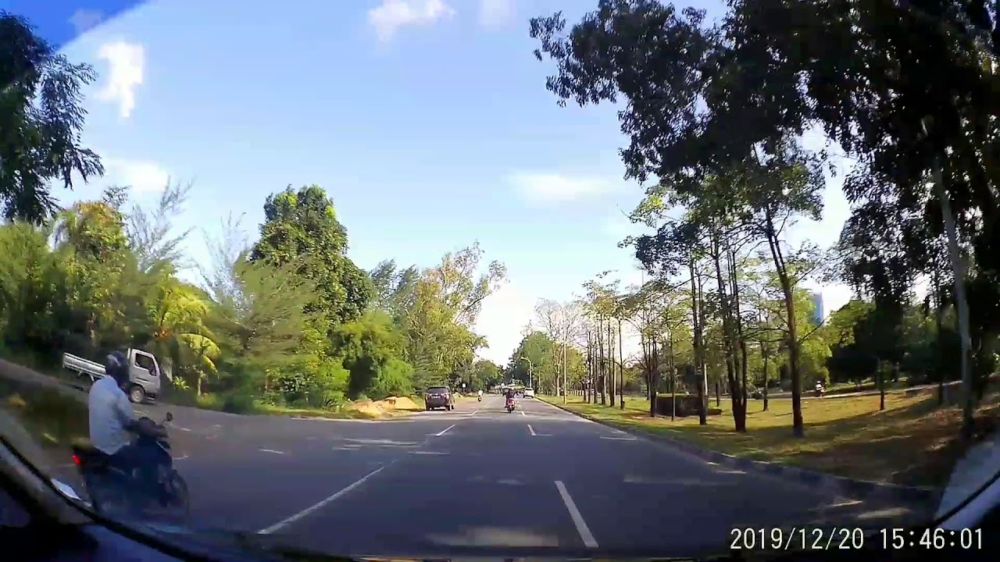
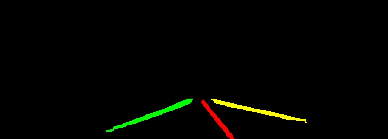
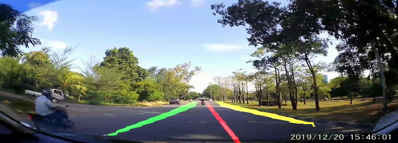

# Lane Detection

This is a project for detecting lane in a road. 


### Read this before you start

This repo does not contains training, as it only used for testing with pretrained model. 

Please refer to the original library for the training, and use this library next for your testing
in your real world application.


### Supported 
These are the supported model for lane detection.

- SCNN Lane Detection from [Harry Han](https://github.com/harryhan618/SCNN_Pytorch) project.

### How to install

1. Install the Library from [here](https://pypi.org/project/laneDetection/)

    ``pip install laneDetection``
    
2. Install the requirement for the library
   
   Refer to the latest requirements.txt

    ``pip install -r requirements.txt``


### Sample Code (Demo)

To see if the library loaded successful.

```
import SCNN_Lane_Detection as scnn_lane_detection
import cv2
```

Initialize SCNN pretrained weight which can be find [here]()

```
scnn_lane_detection.init('.../vgg_SCNN_DULR_w9.pth')
```

Find road lane image and get the url. You can try [this](https://i.ytimg.com/vi/szhG6iPJmE4/maxresdefault.jpg)
```
url = 'https://i.ytimg.com/vi/szhG6iPJmE4/maxresdefault.jpg'
scnn_lane_detection.predictThreshold(0.05)
img, lane_img = scnn_lane_detection.demo(url)
```


Here you can see the lane_img with
```
cv2.imshow("Lane Image", lane_img)
cv2.waitKey(0)
```
This is the Lane showed in different color which is shown below.


But if we need to combine them with our original picture to see if it fits can be done with
```
res = scnn_lane_detection.getAddWeight(img, lane_img)
cv2.imshow("Final Result", res)
cv2.waitKey(0)
```
Which can be seen here



